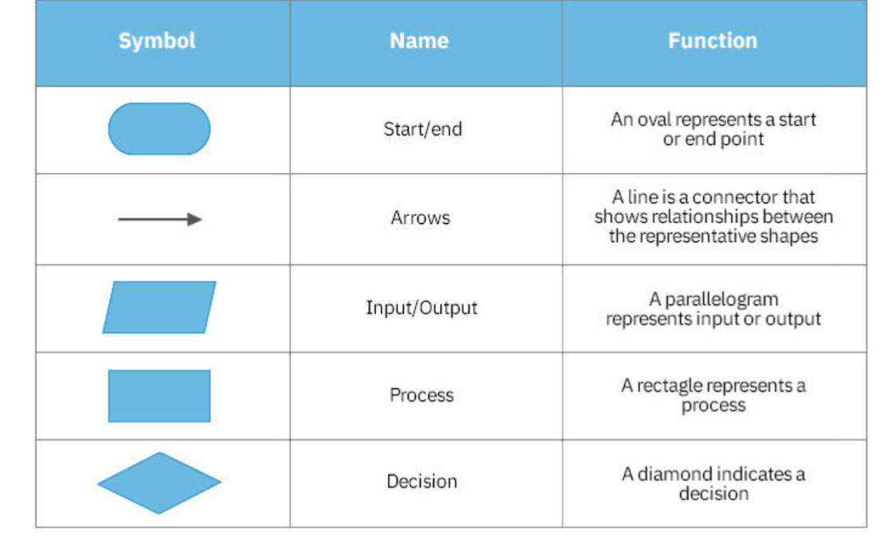

Final Notes for Java

**Review Class Diagrams and Flowcharts**
 - class diagrams are helpful for understanding the structure of a class and its methods before you start writing code.
 - flowcharts are helpful for understanding the flow of a program, including the order of execution and the flow of control.


**Class Diagrams:**

* Separation of fields and methods in class diagram by ------
* Show return types, parameters, and variables as well as access modifiers
* Show inheritance etc.



**Important Note:**

Remember that parameters of a method are specific to that method and are obvious.

**Example Method Signature:**

```java
void setAge(int age)
```

**Review and Know All Learning Outcomes:**

* Terms
* Definitions
* Concepts

Review all modules and know the content of each section.
They have been updated.
Review the downloaded files and conduct self assessment using MPC and short and long answer questions as well as code based questions.

Number systems: Review document itself. 

REvisit all questions from previous quizes and midterms as well as the presentations. 

Quick sort and heap sort. Know flowcharts for all sorting algorithms. Specifically selection sort, bubble sort, and insertion sort. 

Know resizing of an array. 

Printing and contains within a linked list. 
Review node, head, tail syntax. 
Adding, removing, checking contains. 

No curved lines connecting flowchart sections.
Be sure to show the exact control flow of the program. Do not assume anything. 

